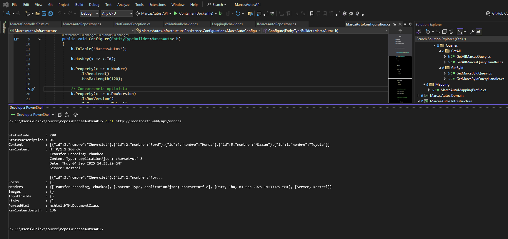
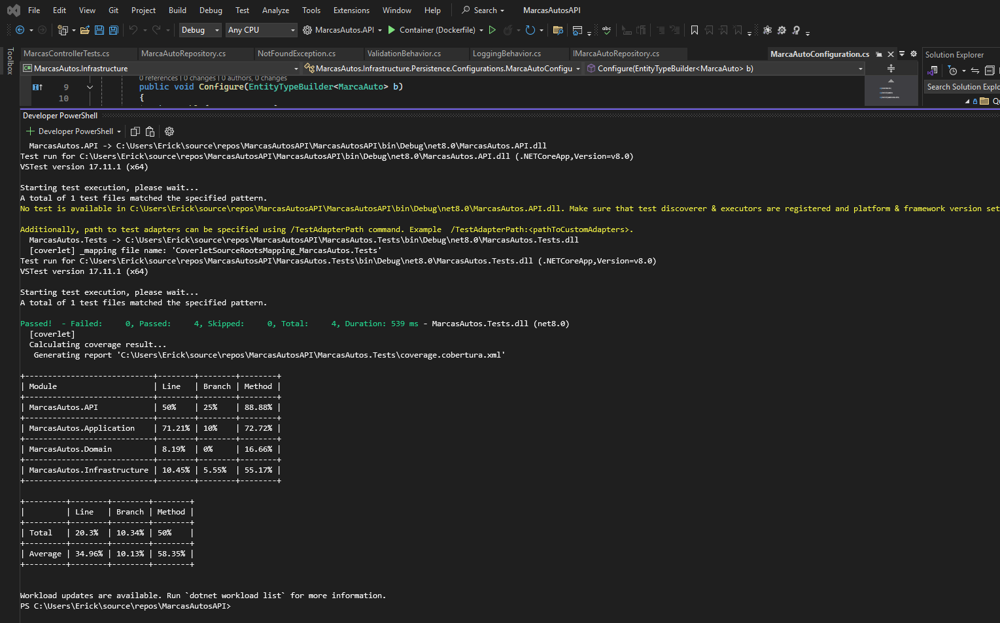

# MarcasAutosAPI

API REST construida con **.NET 8**, **Entity Framework Core**,
**MediatR** y **Clean Architecture** para la gestión de marcas de
autos.\
Incluye un proyecto de pruebas unitarias con **xUnit**, **Moq** y
**FluentAssertions**, además de reportes de cobertura de código.

------------------------------------------------------------------------

## 🚀 Tecnologías principales

-   **.NET 8** (ASP.NET Core Web API)
-   **Entity Framework Core** con PostgreSQL
-   **MediatR** (CQRS y pipeline behaviors)
-   **FluentValidation** para validaciones
-   **Swagger/OpenAPI** para documentación
-   **xUnit + Moq + FluentAssertions** para pruebas
-   **Coverlet + ReportGenerator** para cobertura

------------------------------------------------------------------------

## 📂 Estructura de la solución

    MarcasAutosAPI/
    │
    ├── MarcasAutos.API/                # Proyecto Web API
    │   ├── Controllers/                 # Endpoints REST
    │   └── Program.cs                   # Configuración principal
    │
    ├── MarcasAutos.Application/         # Capa de aplicación (CQRS, Dtos, Validaciones)
    │
    ├── MarcasAutos.Infrastructure/      # Infraestructura (EF Core, DbContext, Persistencia)
    │
    ├── MarcasAutos.Domain/              # Entidades de dominio
    │
    └── MarcasAutos.Tests/               # Proyecto de pruebas unitarias
        └── Unit/Controllers/            # Tests de controladores

------------------------------------------------------------------------

## ⚙️ Configuración y ejecución

### 1. Clonar repositorio

``` bash
git clone <url-del-repo>
cd MarcasAutosAPI
```

### 2. Migraciones y base de datos

Asegúrate de tener PostgreSQL en ejecución y la cadena de conexión
configurada en `appsettings.Development.json`.

Aplicar migraciones y seed de datos:

``` bash
dotnet ef database update --project MarcasAutos.Infrastructure --startup-project MarcasAutos.API
```

### 3. Ejecutar la API

``` bash
dotnet run --project MarcasAutos.API
```



La API estará disponible en:\
👉 http://localhost:5000/swagger


------------------------------------------------------------------------

## 🧪 Pruebas unitarias

### Ejecutar tests

``` bash
dotnet test MarcasAutos.Tests
```

### Ejecutar tests con cobertura

``` bash
dotnet test MarcasAutos.Tests `
  --collect:"XPlat Code Coverage" `
  --results-directory ./TestResults
```



------------------------------------------------------------------------

## 📊 Reporte de cobertura

Generar reporte HTML con **ReportGenerator**:

``` bash
reportgenerator `
  -reports:"./TestResults/**/coverage.cobertura.xml" `
  -targetdir:"./coverage-report" `
  -reporttypes:"HtmlInline_AzurePipelines;Cobertura"
```

Abrir el reporte en navegador:

    ./coverage-report/index.html

------------------------------------------------------------------------

## 📌 Endpoints disponibles

-   **GET** `/api/marcas` → Listar todas las marcas\
-   **GET** `/api/marcas/{id}` → Obtener marca por ID

------------------------------------------------------------------------

## ✅ Estado actual

-   [x] API funcional con endpoints de consulta (`GET`)\
-   [x] Migraciones iniciales con seed de datos\
-   [x] Proyecto de pruebas unitarias\
-   [x] Cobertura de código configurada

------------------------------------------------------------------------

## 📜 Licencia

Proyecto desarrollado como prueba técnica. Uso libre con fines
educativos y de evaluación.
